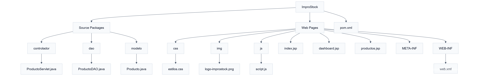

# ImproStock

ImproStock es una aplicación web desarrollada como proyecto académico para la gestión básica de inventarios. El sistema fue construido siguiendo el patrón MVC utilizando Jakarta EE (JSP y Servlets) y Bootstrap para la interfaz de usuario.

## Características

- Inicio de sesión.
- Dashboard principal.
- Gestión de productos.
- Registro y visualización de productos en memoria.
- Interfaz responsive con Bootstrap 5.
- Código organizado por capas (Modelo, Controlador y Vista).

## Tecnologías utilizadas

- Java
- Jakarta EE
- JSP
- Servlets
- Maven
- Apache Tomcat
- Bootstrap 5
- HTML5
- CSS3
- JavaScript

## Estructura del proyecto

